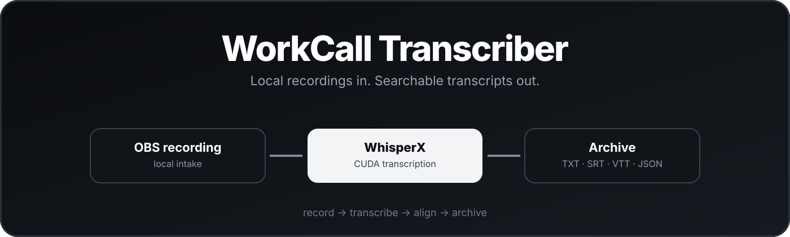

<p align="center">
  
</p>

<div align="center">

# WorkCall Transcriber

**Local Windows transcription for OBS call recordings with WhisperX, GPU acceleration, durable job state, and optional speaker diarization.**


[Everyday use](#everyday-use) · [Build and install](#build-and-install) · [Security](#security-and-safety) · [Architecture](ARCHITECTURE.md) · [Handoff](HANDOFF.md)

</div>

WorkCall Transcriber keeps its application data under `D:\WorkCalls` and deliberately reuses the existing `D:\WhisperWork\.venv` for GPU transcription. It does not install into, modify, or delete anything from that external WhisperX environment.

## What it does

- Watches `D:\WorkCalls\Inbox` only after automatic processing has been explicitly enabled. It starts disabled on a new install.
- Keeps automatic intake fixed to that Inbox; Settings shows the path and can open it, but cannot redirect the watcher to another recording folder.
- Waits for a supported media file to remain stable for 15 seconds and checks it with `ffprobe` before accepting it.
- Safely archives every accepted recording before transcription, then records durable job state in SQLite.
- Allows an Archive location only inside `D:\WorkCalls`, and applies that validated setting to new jobs.
- Runs one external CUDA WhisperX `large-v3` worker at a time, with `float16` inference and alignment.
- Writes a canonical `transcript.json`, readable TXT, SRT, VTT, TSV, `manifest.json`, and a per-job processing log.
- Supports optional pyannote speaker diarization. The token is protected with Windows DPAPI for the current user; it is never placed in the command line, worker spec, manifest, or log output.

## Runtime layout

`D:\WorkCalls` is intentionally separate from the project and installation folders:

```text
D:\WorkCalls
├── Inbox\       automatic intake only
├── Archive\     immutable per-call source + transcript outputs
├── Temp\        disposable per-job processing files
├── Logs\        application logs
└── State\       settings, DPAPI credential blob, SQLite job state
```

An archive job folder is named by date, time, source stem, and job id. It contains `original_<recording-name>` plus the output files. A manual source is always copied and hash-verified, so the chosen original remains untouched. An Inbox source is moved into its archive when safe; if that is not possible, it is copied, hash-verified, and only then removed from Inbox.

## Requirements

- Windows 10 1809 or later.
- NVIDIA GPU and a usable CUDA-enabled WhisperX installation at `D:\WhisperWork\.venv`.
- `ffmpeg` and `ffprobe` available to that environment's `PATH`.
- Enough free space for the archived original and temporary extracted audio.

For speaker diarization, the current Windows user must accept the required Hugging Face model terms and save a valid Hugging Face token in **Settings**. Without one, transcription and alignment still complete; the job is marked **Completed with warnings** and no speaker labels are assigned.

## Build and install

From an elevated-or-normal PowerShell prompt in the project folder, create the isolated project environment once:

```powershell
.\.venv\Scripts\python.exe -m pip install -e '.[dev]'
```

Build the distributable and install it for the current Windows user:

```powershell
.\scripts\build.ps1
.\scripts\install.ps1
```

The installed executable is:

```text
%LOCALAPPDATA%\WorkCall Transcriber\WorkCallTranscriber.exe
```

Installation also creates a Start Menu shortcut and a `HKCU\...\Run` autostart entry that launches the app minimized. It creates the required `D:\WorkCalls` folders without deleting existing recordings or archives.

## Everyday use

1. Start the app from the Start Menu or tray icon.
2. Leave automatic processing disabled until the OBS recording destination is intentionally configured to the fixed `D:\WorkCalls\Inbox` shown in Settings.
3. Click **Enable automatic processing** when ready. Only direct children of the configured Inbox are watched.
4. Alternatively, choose **Process file**. Files selected outside Inbox are copied into a new archive job, so the source is preserved.
5. Open a completed job to access the archive folder and outputs. Use **Retry** after resolving a transient GPU, FFmpeg, or diarization problem.

The queue detects a completed identical recording by SHA-256 and does not silently run it again. A second attempt is shown as a duplicate rather than overwriting existing output.

## Security and safety

- Recordings are local; no audio is sent by the application itself to an online transcription service.
- The diarization credential is encrypted with Windows DPAPI and is scoped to the current Windows user.
- Worker stdout is reserved for structured JSON progress events. Diagnostics go to the archive log with token redaction.
- Cancelling, a worker crash, and an application restart leave the archived source intact. The worker PID is recorded before processing; startup verifies a recorded orphan's executable and exact worker arguments before stopping it. If a crash occurs just before that PID is persisted, it safely enumerates and verifies only the matching worker command for that job spec as well. If process verification or the worker mutex is inconclusive, the queue stays blocked rather than risk a second GPU worker; a final manifest restores completed work only when all required exports exist after a GUI crash.
- The uninstaller removes the app, shortcut, and autostart entry. It never removes `D:\WorkCalls\Archive` or `D:\WorkCalls\Inbox`; removal of settings, logs, and temp files is an explicit prompt.

## Verification and development

Run the automated checks from the repository root:

```powershell
.\.venv\Scripts\python.exe -m pytest -q
.\.venv\Scripts\ruff.exe check .
```

The frozen app is built with PySide6 6.9.3. Do not upgrade that dependency without rebuilding and smoke-testing the packaged executable: this version was validated on the target Windows 10 installation after a newer Qt bundle failed during `QtWidgets` import.

See [ARCHITECTURE.md](ARCHITECTURE.md) for internals and [HANDOFF.md](HANDOFF.md) for operational validation notes.
